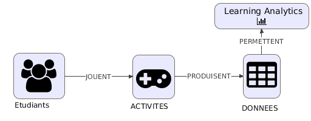
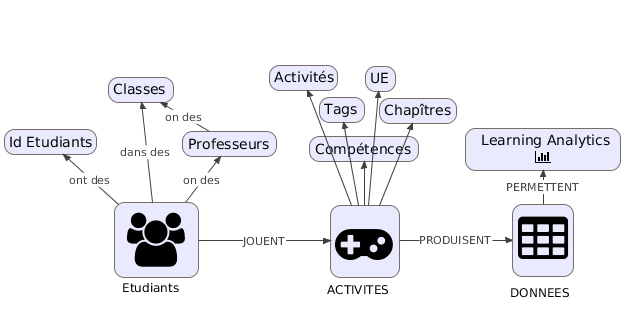
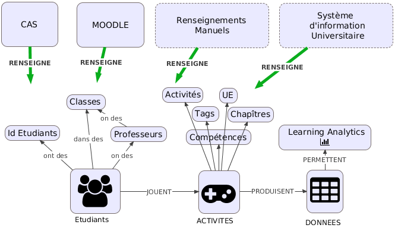

% Atelier Ikigai Learning Analytics
% 24 Juin 2019


# Introduction


## But de la présentation

- Nos moyens de collecte
- Nos projets actuels
- Nos questionnements
- Discussion sur les convergences possibles basées sur vos problématiques


## Qui suis-je ?

- Bruno Martin
- Docteur en psychologie cognitive + EIAH (co-dirigé par J.M Labat)
- Post Doc sur les Learning Analytics (dirigé par V. Luengo)
- Lead Developer + **architecte système** du portail IKIGAI


# Les Learning Analytics


## Définition

- Relativement récent (Learning Analytics & Knowledge Conference : 2011)
- Définition simple : **Collection et analyse des données issues d'un contexte d'apprentissage**

## On le fait depuis longtemps ?

## Exemples

- On le fait depuis longtemps, mais sous un autre nom avec des objectifs précis 
	- Educational Data Mining
	- Analyse des traces en EIAH
	- Psychologie cognitive des apprentissages
	- Tuteurs Intelligents

## Différences avec les LA

- Recueil de données :
	- Systématique **VS** ciblé et ponctuel
- Analyses 
	- Orienté décisions et recommandations **VS** Questions fondamentales

## Exemple typique :
- Tableau de Bord pour enseignant portant sur l'activité de ses élèves et emettant des :
	- alertes
	- recommandations

# Ikigai et les LA

- Portée éducative basée sur :
	- Les jeux eux-mêmes
	- Les données obtenues


## Notre architecture de collecte de données 

## {data-background="images/archi_data.png"}

## -

## Notre utilisation de xAPI


## 1. Pour représenter les actions du joueur

Exemple minimal de statement : [https://xapi.com/statements-101/](https://xapi.com/statements-101/)

```js
{
"actor": {
   "name": "Sally Glider",
   "mbox": "mailto:sally@example.com"
},
"verb": {
   "id": "http://adlnet.gov/expapi/verbs/experienced",
   "display": { "en-US": "experienced" }
},
"object": {
   "id": "http://example.com/activities/solo-hang-gliding",
   "definition": {
      "name": { "en-US": "Solo Hang Gliding" }
   }
}
}
```


## Statements issus de MastersQuiz

<div style="width: 100vw;overflow-y: scroll; float:left;">
```js
{
    "actor": {
        "objectType": "Agent",
        "name": "4cdf56fb608c4668c3bcc524348cca3c3208d1ecBALpseudo=anonyme",
        "mbox": "mailto:4cdf56fb608c4668c3bcc524348cca3c3208d1ecBALpseudo_anonyme@ikigai-quiz.com"
    },
    "verb": {
        "id": "http://activitystrea.ms/schema/1.0/answered",
        "display": {
            "en-US": "answered",
            "fr": "a répondu"
        }
    },
    "object": {
        "objectType": "Activity",
        "id": "http://ikigai.games/activities/quiz/seeQuestion/b5aef2d5-7818-49b2-8cec-8fe9856841c9",
        "definition": {
            "name": {
                "en-US": "",
                "fr": "\\text{Mon premier est deux}\\text{Mon premier est deux}"
            },
            "description": {
                "en-US": "http://activitystrea.ms/schema/1.0/question",
                "fr": "http://activitystrea.ms/schema/1.0/question"
            },
            "type": "http://adlnet.gov/expapi/activities/cmi.interaction",
            "interactionType": "choice",
            "choices": [{
                "id": "b5aef2d5-7818-49b2-8cec-8fe9856841c9-oKsQ9TNiEgVN1bYYmZ",
                "description": {
                    "en-US": "",
                    "fr": ""
                }
            }],
            "correctResponsesPattern": ["b5aef2d5-7818-49b2-8cec-8fe9856841c9-oKsQ9TNiEgVN1bYYmZ"],
            "extensions": {
                "http://ikigai.games/xapi/extension/room-id": "4cdf56fb608c4668c3bcc524348cca3c3208d1ec6/21/2019 4:34:52 PM86",
                "http://ikigai.games/xapi/extension/time-since-start-question-id": "PT0H0M4.00S"
            }
        }
    },
    "result": {
        "success": true,
        "duration": "PT0H0M4.00S",
        "response": "b5aef2d5-7818-49b2-8cec-8fe9856841c9-oKsQ9TNiEgVN1bYYmZ"
    },
    "context": {
        "contextActivities": {
            "category": [{
                "objectType": "Activity",
                "id": "http://ikigai.games/tags/ue/7453f06d-c2b8-4228-8700-102816a780f8",
                "definition": {
                    "name": {
                        "en-US": "NomUETestLive",
                        "fr": "NomUETestLive"
                    }
                }
            }, {
                "objectType": "Activity",
                "id": "http://ikigai.games/tags/ue/7453f06d-c2b8-4228-8700-102816a780f8/chapters/1",
                "definition": {
                    "name": {
                        "en-US": "1",
                        "fr": "1"
                    }
                }
            }, {
                "objectType": "Activity",
                "id": "http://ikigai.games/tags/year/L3",
                "definition": {
                    "name": {
                        "en-US": "L3",
                        "fr": "L3"
                    }
                }
            }, {
                "objectType": "Activity",
                "id": "http://ikigai.games/tags/subject/Biologie",
                "definition": {
                    "name": {
                        "en-US": "Biologie",
                        "fr": "Biologie"
                    }
                }
            }]
        }
    },
    "timestamp": "2019-06-21T16:35:01.075739+02:00"
}
```
</div>

## 2. Pour faciliter la collecte et les requêtes

La norme xAPI porte **aussi** sur l'API exposée par les entrepôts de statements (Learning Record Store)


## {data-background="images/archi_lrs.png"}


## -


## Projets

- [Integration à Memorae](http://memorae.hds.utc.fr/img/poster.jpg)
- [Integration à OpenLRW](https://github.com/Apereo-Learning-Analytics-Initiative/OpenLRW) (projet porté par l'équipe Capsule)
- Mise à disposition d'une large base de données
- Adaptations et retours pédagogiques dans les jeux
- Croisement avec d'autres sources de données (ex: réussite dans les UE)
- [Tableau de Bord xAPI flexible](http://www.ikigai.games/demodashboard/#login/JsonLoader)


## Intégration aux données pédagogiques de l'université


## Vision naïve 



## Vision éclairée



## Vision éclairée (bis)




## Central Authentication Service

- Permet de :
	- Attester de la provenance universitaire
	- Obtenir des informations importantes (Affiliations, Identifiants)

## Demo de l'utilisation de CAS

[USAGE DE CAS](http://preprod-play.lutes.upmc.fr/loginandsubscribe/login)


# Ikigai et la recherche en LA

## Trajectoire envisagée

- Permettre et bénéficier des analyses de données
- Portail comme plateforme de collecte (ponctuellement agnostique)

## Quelques questions que nous nous posons à Ikigai (1)

- Mesurer l'apprentissage et comprendre le comportement de nos joueurs (psychologie cognitive, didactique, sociologie)
- Concevoir un jeu en cycle court, guidé par les données.
- Spécifités des jeux de simulation, quels apports sur les apprentissages ?


## Enjeux des données pour Ikigai (2)

- Aider les étudiants (exemple : recommandations, diagnostic de compétences)
- Aider les enseignants (exemple : adaptation du cours, guidé par les données)
- Appuyer la recherche sur :
	- Les deux points précédents
	- Problématiques liées 


## Thématiques courantes en Learning Analytics (0)


The Learning & Student Analytics Conference (LSAC) 2019
```
Pernalised learning and individual learning support,
Learning community support,
Pro-active, goal oriented learning support, 
Connecting learning to society and the labour market, 
LA policies, 
Learning activities visualization,
Data mining and LA, 
Effects of LA on learning behaviour, 
Effects of LA on assessment,
Student performance prediction,
Social learning evaluation, learners interaction, 
Learning materials and tools improvement, 
Ethics and privacy in LA, 
Affective and emotional states of learners,
Student engagement, 
Student support and advisory, 
Individuals and communities, 
Dashboards for learners or instructors, 
Learning Analytics implementation
```


## Thématiques courantes en Learning Analytics (1)


- Améliorations de l'apprentissage
	- adaptation, personalisation
	- engagement, aspects affectifs
	- aspects sociaux
- Analyses et décisions humaines
	- indicateurs 
	- visualisations
	- conception Tableaux de bord

## Thématiques courantes en Learning Analytics (2)

- Implémentations
	- éthique, respect de la vie privée
	- standards
	- technologies
- Analyses statistiques
	- Extraction de connaissances
	- Modèles prédictifs
	- Clustering ...

## Questions

- Jugez vous que c'est un bon résumé des thèmes de recherches ?
- Comment vous situez vous vis-à-vis de ces questions ?
- Dans quelle mesure Ikigai peut vous appuyer sur ces questions de recherche ? (et réciproquement...?)
