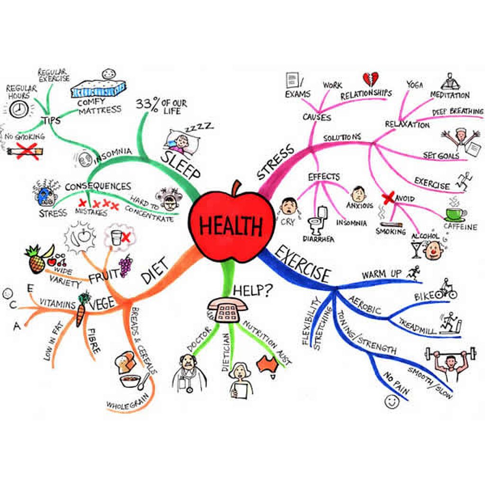

% Mind Mapping numérique
% Bruno Martin
% 25 avril 2016

https://github.com/brumar/presentations

## But de la présentation

> - Présentation rapide du mind mapping
> - Logiciels
> - Mind Mapping et visualisation de données, un terrain à exploiter ?
> - Projet Livemapping

# Mind Mapping ? kesako ?

## Définition

- Technique "manuelle" de représentation de l'information
- Organisation arborescente
- Synthétique (mots-clefs, groupe de mots)
- Eléments visuels (couleurs, images, pictogrammes)

## Exemples

### Cartes construites à la main 

------------------

------------------

------------------

### Cartes construites avec un logiciel

------------------

------------------

# Courte Histoire

------------------

## Un Gourou

- A popularisé le Mind Mapping
- Très prolifique
- Empire commercial accès sur la formation
- Discours pseudo-scientifique sur le cerveau
- Proposition de règles strictes (ex : un mot par noeud)

## Arrivée des logiciels

- Permet d'autres usages que la prise de note
- Mind Mapping en entreprise
	- Brainstorming
	- Conduite de projet
- Deux mondes 
	- Le monde logiciel
	- Le monde "Buzan"

# Les logiciels

## Grande quantité !

- Plus de 300 (http://www.mind mapping.org/)
- La plupart ont des fonctionnalités minimales
- Pas tous optimisés pour les mindmaps 

## Quelques logiciels en ligne

- Utile pour collaborer ou partager rapidement des cartes 
- Sinon : utiliser plutôt un logiciel bureau

## premiums

- Mindmeister 
	- plus de 3 millions d'utilisateurs
- Mindomo 
	- principal concurrent de Mindmeister
- Coggle
	- version gratuite moins limitée que Mindmeister et Mindomo
	
## Open-source

- Mindmup  (https://github.com/mindmup/mindmup)
- Mindmaps  (https://github.com/drichard/mindmaps)
	- Version live sur framasoft et sur drichard.org/mindmaps
- Wise Mapping (https://github.com/Rohja/wisemapping)
	- Version live sur framasoft
	- Plus complet et agréable que Mindmaps
	- Mais code source difficilement lisible

## Quelques logiciels bureau

## Open-source

- Freemind/Freeplane
- Xmind (premium, license double)

## Payants

- Mindjet (400-500 euros...)
- IMindmap (100-200 euros...)

# Librairies et APIs

## Formats

- Quelques formats "classiques"
	- import/export .mm (format de freemind/plane)
	- OPML (encore plus minimal)
- Formats
	- Web : .json
	- Bureau : .xml
	- Archives zip
- Pas de format universel
- pas de lecteur universel

## API de certains logiciels en ligne

- Mindmeister : https://www.mindmeister.com/fr/developers/introduction
- Coggle : https://embed.coggle.it/diagram/532f2f5007eb88f857000976/06b3a62e14eb54cf7e99086f3cf7dd0398af0ecca4476a8778cad4a67eba53bb
- Mindmup : http://discover.mindmup.com/geeks

## Logiciels "bureau"
- XMind
	- Librairie Java & python
	- OSGi framework
	- Faible communauté
- FreePlane 
	- beaucoup d'API et de librairies
	- OSGi framework
	- Forte communauté
	
## Librairies javascript 
- (généralement issues de la visualisation de données)
- gojs http://gojs.net/latest/samples/mindMap.html
- d3.js exemple: http://tommykrueger.com/projects/d3tests/
- JavaScript InfoVis Toolkit (SpaceTree, HyperTree)
- jsmind (exception interessante, librairie spécialisée)

# Quels ponts possibles avec la visualisation de données ?

## Mind maps

- subjectives
- forme d'arbre
- manuels
- faible quantité de données
- schémas à taille humaine
- cognition -> carte

## Data-Viz

- objectives
- forme de graphe
- grande quantité de données
- grand schémas
- carte -> cognition

## Piste : chercher des ponts à partir de cas d'utilisations ?

- Lister les cas d'utilisation du mind mapping et des data-viz
- Trois cas possibles :

## 1. Cas d'utilisation commun ou proche
- Réfléchir aux avantages/inconvénients de chaque approche 
- Eventuelles complémentarités

## 2. Cas d'utilisation propre au mind mapping
- Est-il possible et souhaitable d'enrichir la carte par une fouille de données :
	- Autres mindmaps
	- Autres sources d'information (ex : wikipedia)
- Est-il interessant de demander à l'utilisateur d'enrichir sémantiquement les liens (-> construction d'une ontologie)
	
## 3. Cas d'utilisation propre aux data-viz
- Est-il possible et souhaitable de :
	- (1) Forcer le graphe sous une représentation arborescente ?
	- (2) Exporter sous forme de mindmap 
	- (3) Restructurer, ajouter des informations, des couleurs ?

# Projet Livemapping

## Projet

> - En paralèlle de ma thèse 
> - Donc peu abouti
> - But : Fournir en temps réel une mind map d'un évènement
> - Service de prise de note (équivalent du livesketching pour le mind mapping)

## Intérêt

- Gestion des connaissances
- Pour l'auditeur => revoir les points clefs juste après l'évènement

## Actualité du projet

- Jusqu'à présent : activité bénévole
- Collègue : Timothée Behra 
- Fonctionnement :
	- Recherche d'emissions publiques sympas (radio, livestream sur youtube ...)
	- Manifeste sur les réseaux sociaux
	- mind mapping avec XMind
	- Synchronisation avec un lecteur d'image sur livemapping.fr

## Futur du projet

- Vendre un service de prise de note en temps réel
- Meilleure solution technologique
	- Plus interactive
	- Plus ouverte
		- Support d'interaction post-évènement (en alternative aux espaces commentaires)
		- Autres mindmappeurs